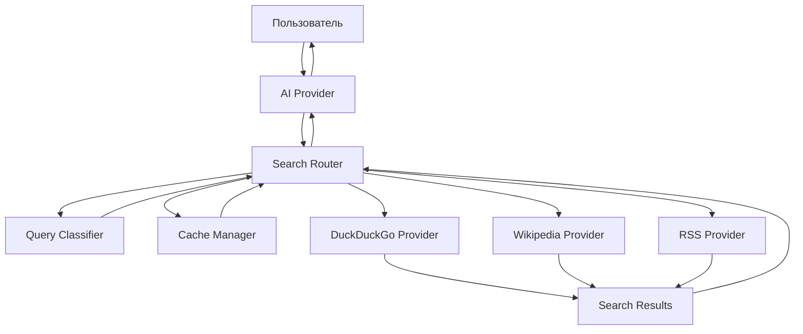
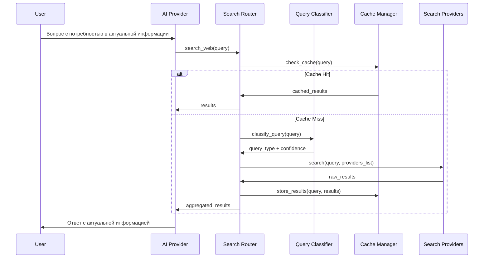

# Архитектура системы веб-поиска

## Обзор

Система веб-поиска предназначена для предоставления локальным AI моделям доступа к актуальной информации из интернета без использования платных API. Система использует интеллектуальную классификацию запросов для выбора оптимального источника данных.

## Основные компоненты

### 1. QueryClassifier - Классификатор запросов
Анализирует пользовательский запрос и определяет наиболее подходящий тип поиска.

**Типы запросов:**
- `factual` - Фактические/энциклопедические вопросы (Wikipedia)
- `current` - Актуальные новости и события (RSS + DuckDuckGo)
- `general` - Общие поисковые запросы (DuckDuckGo)
- `mixed` - Комбинированный поиск (несколько источников)

### 2. SearchProvider - Абстрактный базовый класс
Определяет интерфейс для всех поисковых провайдеров.

### 3. Конкретные провайдеры
- **DuckDuckGoProvider** - Общий веб-поиск
- **WikipediaProvider** - Энциклопедические данные
- **RSSProvider** - Новости и RSS-ленты

### 4. SearchRouter - Маршрутизатор поиска
Координирует работу классификатора и провайдеров, принимает решения о том, какие источники использовать.

### 5. CacheManager - Менеджер кэша
Управляет кэшированием результатов поиска для повышения производительности и снижения нагрузки на внешние сервисы.

## Архитектурная диаграмма



## Поток данных



## Детальное описание компонентов

### QueryClassifier

**Алгоритм классификации:**

1. **Ключевые слова и паттерны:**
   - Фактические: "что такое", "кто такой", "определение", "история"
   - Актуальные: "новости", "сегодня", "вчера", "текущий", "последний"
   - Общие: все остальные запросы

2. **Временные маркеры:**
   - Наличие дат, времени → `current`
   - Исторические события → `factual`

3. **Именованные сущности:**
   - Известные личности, места, концепции → `factual`
   - Компании, события → `current`

**Конфигурируемые правила:**
```python
CLASSIFICATION_RULES = {
    "factual": {
        "keywords": ["что такое", "кто такой", "определение", "история", "биография"],
        "patterns": [r"\bwho is\b", r"\bwhat is\b", r"\bdefine\b"],
        "weight": 0.8
    },
    "current": {
        "keywords": ["новости", "сегодня", "вчера", "текущий", "последний", "актуальный"],
        "patterns": [r"\b(today|yesterday|current|latest|recent)\b"],
        "weight": 0.9
    }
}
```

### DuckDuckGoProvider

**Возможности:**
- Поиск веб-страниц без ограничений API
- Поддержка региональных настроек
- Безопасный поиск
- JSON API для программного доступа

**Конфигурация:**
```python
DUCKDUCKGO_CONFIG = {
    "base_url": "https://api.duckduckgo.com/",
    "max_results": 10,
    "safe_search": "moderate",
    "region": "ru-ru",
    "timeout": 30
}
```

### WikipediaProvider

**Возможности:**
- Поиск статей по ключевым словам
- Получение краткого содержания
- Поддержка множественных языков
- Извлечение ссылок и категорий

**Конфигурация:**
```python
WIKIPEDIA_CONFIG = {
    "language": "ru",
    "fallback_languages": ["en"],
    "max_summary_length": 1000,
    "include_images": False,
    "timeout": 20
}
```

### RSSProvider

**Источники новостей:**
- Общие новости: РБК, ТАСС, Интерфакс
- Технологические: Хабр, CNews
- Международные: BBC Russian, DW Russian
- Настраиваемые пользователем источники

**Конфигурация:**
```python
RSS_SOURCES = {
    "news": [
        "https://rss.rbc.ru/rbcnews/news.rss",
        "https://tass.ru/rss/v2.xml",
        "https://www.interfax.ru/rss.asp"
    ],
    "tech": [
        "https://habr.com/ru/rss/hub/programming/",
        "https://www.cnews.ru/inc/rss/news.xml"
    ],
    "international": [
        "https://www.bbc.com/russian/news/rss.xml"
    ]
}
```

## Стратегии поиска

### 1. Единый источник
Для четко классифицированных запросов используется один оптимальный источник.

### 2. Параллельный поиск
Для `mixed` запросов выполняется поиск в нескольких источниках параллельно.

### 3. Каскадный поиск
Если первый источник не дает результатов, автоматически переходим к следующему.

### 4. Гибридный результат
Объединение результатов с разных источников с указанием источника каждого результата.

## Система кэширования

### Структура кэша
```sql
CREATE TABLE search_cache (
    query_hash TEXT PRIMARY KEY,
    query_text TEXT,
    query_type TEXT,
    results TEXT, -- JSON
    source_providers TEXT, -- JSON array
    created_at TIMESTAMP,
    expires_at TIMESTAMP,
    access_count INTEGER DEFAULT 1
);
```

### Стратегии кэширования
- **Factual**: долговременное кэширование (24 часа)
- **Current**: краткосрочное кэширование (1 час)
- **General**: среднесрочное кэширование (6 часов)

### Политики очистки
- LRU (Least Recently Used)
- TTL (Time To Live)
- Размер кэша (максимальное количество записей)

## Интеграция с AI Providers

### Расширение конфигурации
```json
{
  "ai_providers": {
    "ollama": {
      "web_search": {
        "enabled": true,
        "auto_search_triggers": ["найди", "поищи", "актуальная информация"],
        "max_search_results": 5
      }
    }
  },
  "web_search": {
    "default_strategy": "smart_routing",
    "providers": {
      "duckduckgo": {"enabled": true, "weight": 0.7},
      "wikipedia": {"enabled": true, "weight": 0.9},
      "rss": {"enabled": true, "weight": 0.8}
    }
  }
}
```

### Автоматическое обнаружение потребности в поиске
AI модель может автоматически определить, когда нужна актуальная информация:
- Анализ запроса на временные маркеры
- Обнаружение неизвестных сущностей
- Явные триггеры в тексте

## Обработка ошибок и отказоустойчивость

### Стратегии отработки ошибок
1. **Retry Logic**: повторные попытки с экспоненциальным backoff
2. **Fallback Providers**: переключение на альтернативные источники
3. **Graceful Degradation**: частичные результаты лучше отсутствия результатов
4. **Circuit Breaker**: временное отключение неработающих источников

### Мониторинг и логирование
- Логирование всех поисковых запросов
- Метрики производительности источников
- Статистика использования кэша
- Отчеты об ошибках и недоступности сервисов

## Безопасность и этика

### Rate Limiting
- Ограничение количества запросов к каждому источнику
- Умные задержки между запросами
- Respect robots.txt для веб-скрапинга

### Фильтрация контента
- Проверка на спам и вредоносный контент
- Фильтрация по языку и релевантности
- Удаление дубликатов

### Соблюдение условий использования
- Указание источников в результатах
- Соблюдение лимитов API
- Этичное использование ресурсов

## Метрики и аналитика

### KPI системы
- Время отклика поиска
- Процент попаданий в кэш
- Точность классификации запросов
- Удовлетворенность результатами

### Мониторинг в реальном времени
- Доступность источников данных
- Производительность каждого провайдера
- Использование ресурсов сервера
- Качество результатов поиска

## Планы развития

### Фаза 1: Основная функциональность
- Базовая классификация и маршрутизация
- DuckDuckGo и Wikipedia провайдеры
- Простое кэширование

### Фаза 2: Расширенные возможности
- RSS провайдер
- Улучшенная классификация
- Продвинутое кэширование

### Фаза 3: Интеллектуальные функции
- Машинное обучение для классификации
- Персонализация результатов
- Семантический поиск
- Интеграция с RAG системой